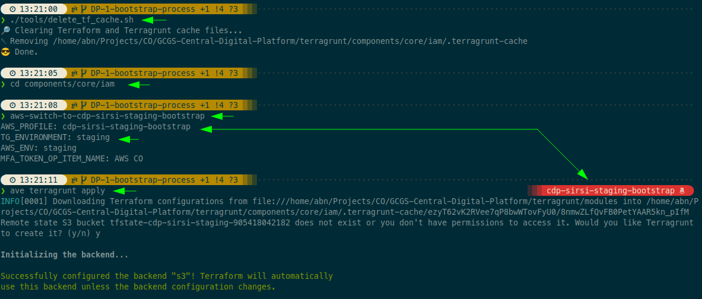
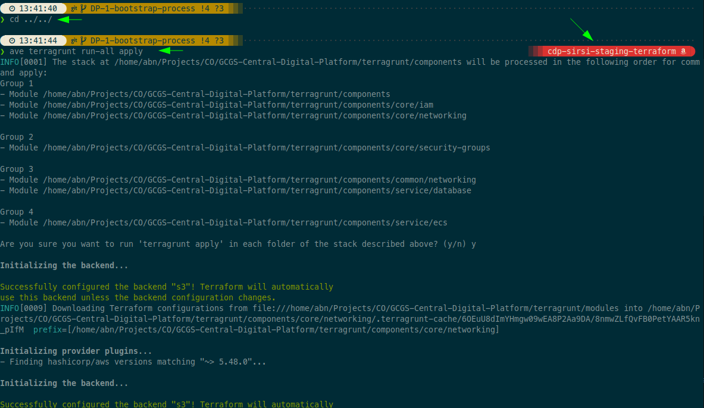

# Central Digital Platform Infrastructure

This code base is responsible for provisioning the AWS infrastructure needed to support the CDP SIRSI application.


## Bootstrap a new account

### Initiate

**TL;DR:**
```shell
# ave is alias for `aws-vault exec` command
# aws-switch-to-* is alias to set the:
# - AWS_PROFILE
# - TG_ENVIRONMENT
# - AWS_ENV (Not compulsory)
# - MFA_TOKEN handler (Out of scope of this documentation)

./tools/delete_tf_cache.sh
cd components/core/iam
aws-switch-to-cdp-sirsi-staging-bootstrap
ave terragrunt apply
aws-switch-to-cdp-sirsi-staging-terraform
ave aws sts get-caller-identity | cat
```

**Summary:**
- Ensure the cache is cleared.
- Navigate to the `core/iam` component.
- Assume the account bootstrap role.
- Set the `TG_ENVIRONMENT` environment variable (staging in the following example).
- Apply Terraform using Terragrunt while the bootstrap role is assumed.
- When Terragrunt prompts for the creation of the state bucket, allow it to be created.
   
- Core IAM will create the Terraform role to be used from now on.
   
- Assume the Terraform role.
- Confirm the caller identity.
   

### Provision rest of the components
- Navigate to the root directory
- Build and push images to ECR
```shell
make build-docker
ave make aws-push-to-ecr
```
- Create the OneLogin secret `cdp-sirsi-one-login-credentials`, i.e:
```shell
ave aws secretsmanager create-secret --name cdp-sirsi-one-login-credentials --secret-string '{"Authority":"https://stagingoidc.example.com", "ClientId": "staging-client-id", "PrivateKey":"DEV RSA PRIVATE KEY"}'
```
- Navigate to the root of components
- Apply all, while terraform role is assumed
