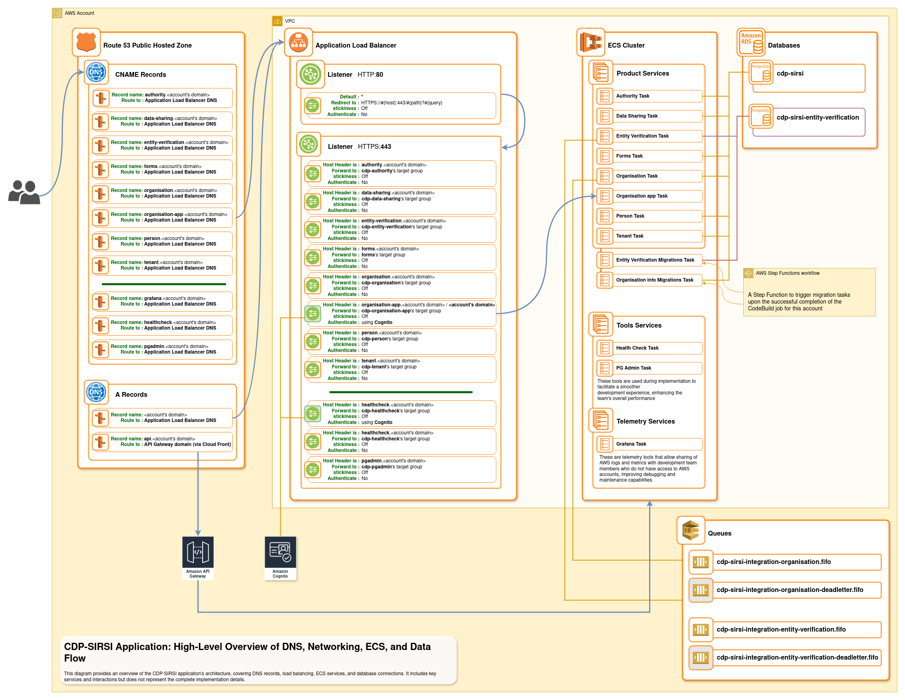
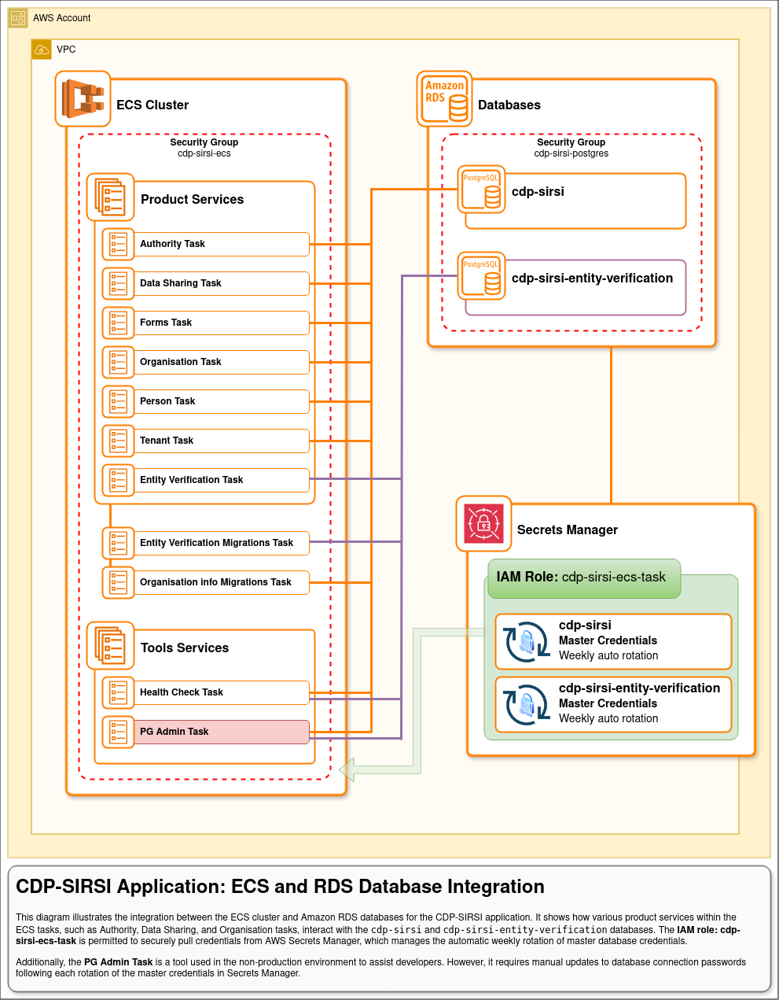
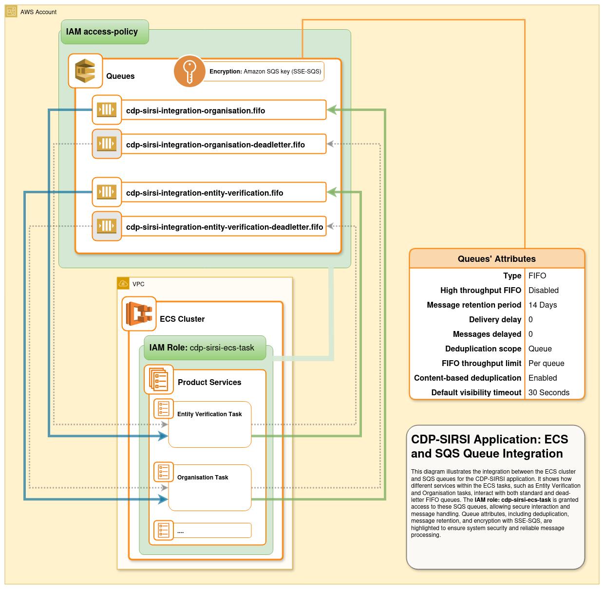

# CDP-SIRSI Infrastructure documentations

## Diagrams

### CDP-SIRSI Application: High-Level Overview of DNS, Networking, ECS, and Data Flow

This diagram provides an overview of the CDP-SIRSI application’s architecture, covering DNS records, load balancing, ECS services, and database connections. It includes key services and interactions but does not represent the complete implementation details.

### CDP-SIRSI Application: ECS and RDS Database Integration

This diagram illustrates the integration between the ECS cluster and Amazon RDS databases for the CDP-SIRSI application. It shows how various product services within the ECS tasks, such as Authority, Data Sharing, and Organisation tasks, interact with the cdp-sirsi and cdp-sirsi-entity-verification databases. The IAM role: cdp-sirsi-ecs-task is permitted to securely pull credentials from AWS Secrets Manager, which manages the automatic weekly rotation of master database credentials.

Additionally, the PG Admin Task is a tool used in the non-production environment to assist developers. However, it requires manual updates to database connection passwords following each rotation of the master credentials in Secrets Manager.

### CDP-SIRSI Application: ECS and SQS Queue Integration

This diagram illustrates the integration between the ECS cluster and SQS queues for the CDP-SIRSI application. It shows how different services within the ECS tasks, such as Entity Verification and Organisation tasks, interact with both standard and dead-letter FIFO queues. The IAM role: cdp-sirsi-ecs-task is granted access to these SQS queues, allowing secure interaction and message handling. Queue attributes, including deduplication, message retention, and encryption with SSE-SQS, are highlighted to ensure system security and reliable message processing.

