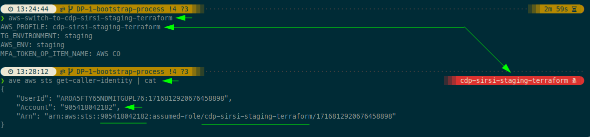

# Bootstrap a New Account

> **Note:** In this documentation, `ave` is an alias for the `aws-vault exec` command, and `aws-switch-to-*` is an alias that configures the following:
> - `AWS_PROFILE`
> - `TG_ENVIRONMENT`
> - `AWS_ENV` (optional)
> - `MFA_TOKEN` handler (out of scope for this documentation)
>
> You are welcome to use any profile manager or tool you are more comfortable with.

## Table of Contents
1. [Add New Account to the Global Configuration](#add-new-account-to-the-global-configuration)
2. [Initiate](#initiate)
3. [Provision Rest of the Components](#provision-rest-of-the-components)
   1. [Create/Update Secrets](#createupdate-secrets)
   2. [Create New Users](#create-new-users)
   3. [Apply Terraform Across All Components](#apply-terraform-across-all-components)
   4. [Run Databases' Migrations](#run-databases-migrations)
4. [Pin Application/Service Version](#pin-applicationservice-version)
5. [Add Deployment Stage(s) To The Pipeline]


---

## Add New Account to the Global Configuration

Before proceeding, ensure that the new account is properly configured by adding it to the global configuration file. You’ll need to define all required attributes under a new section in the [components/terragrunt.hcl](../components/terragrunt.hcl) file, within the `environments` block.

To do this, simply copy the configuration of an existing environment (account) and adjust the values for the new account as needed. Attributes to update include the `account_id`, `name`, `cidr_block`, subnets, and other environment-specific values.

### Example Configuration:

```hcl
environments = {
  new_account_name = {
    cidr_block             = "10.${local.cidr_b_new_account}.0.0/16"
    account_id             = <new_account_id>
    name                   = "new_account_name"
    postgres_instance_type = "db.t4g.micro"
    private_subnets = [
      "10.${local.cidr_b_new_account}.101.0/24",
      "10.${local.cidr_b_new_account}.102.0/24",
      "10.${local.cidr_b_new_account}.103.0/24"
    ]
    public_subnets = [
      "10.${local.cidr_b_new_account}.1.0/24",
      "10.${local.cidr_b_new_account}.2.0/24",
      "10.${local.cidr_b_new_account}.3.0/24"
    ]
    top_level_domain = "<new_account_domain>"
  }
}
```

This ensures the new account is fully integrated into the configuration and is ready for subsequent steps like deployment.

## Initiate

Before provisioning the other components, it is essential to ensure that the basic requirements, especially IAM entities, are in place. Without these, provisioning will fail due to insufficient permissions. To address this, we first need to assume the admin/bootstrap role and provision the project-specific IAM roles required to continue.

Later on, using a similar process but assuming the Terraform role created in this step, we will provision all other components.

**TL;DR:**
```shell
./tools/delete_tf_cache.sh
cd components/core/iam
aws-switch-to-cdp-sirsi-staging-bootstrap
ave terragrunt apply
aws-switch-to-cdp-sirsi-staging-terraform
ave aws sts get-caller-identity | cat
```

**Summary:**
- Ensure the cache is cleared.
- Navigate to the `core/iam` component.
- Assume the account bootstrap role.
- Set the `TG_ENVIRONMENT` environment variable (e.g., staging).
- Apply Terraform using Terragrunt while the bootstrap role is assumed.
- When Terragrunt prompts to create the state bucket, allow it.\
  
- The Core IAM component will create the Terraform role for future use.\
  
- Assume the Terraform role.
- Confirm the caller identity.\
  

## Provision Rest of the Components

### Create/Update Secrets

Ensure all required secrets for the target environment are in place by following the [manage-secrets.md](./manage-secrets.md) instructions.

> **Note**: Some secrets belong to the Orchestrator account only.

### Apply Terraform Across All Components
1. Navigate to the components folder.
2. Apply all components while assuming the **corresponding account's Terraform role**.
   

### Run Databases' Migrations

```shell
# Fetch the AWS Account ID and set the region
export ACCOUNT_ID=$(ave aws sts get-caller-identity --query 'Account' --output text)
export SF_REGION=eu-west-2

# Execute the second Step Function: cdp-sirsi-run-organisation-information-migrations
ave aws stepfunctions start-execution \
    --state-machine-arn arn:aws:states:${SF_REGION}:${ACCOUNT_ID}:stateMachine:cdp-sirsi-run-organisation-information-migrations \
    --name "organisation-information-execution-$(date +%Y%m%d%H%M%S)" \
    --input '{}'

# Execute the first Step Function: cdp-sirsi-run-entity-verification-migrations
ave aws stepfunctions start-execution \
    --state-machine-arn arn:aws:states:${SF_REGION}:${ACCOUNT_ID}:stateMachine:cdp-sirsi-run-entity-verification-migrations \
    --name "entity-verification-execution-$(date +%Y%m%d%H%M%S)" \
    --input '{}'


```
### Create New Users

We use Cognito user pools to restrict access to **non-production accounts**. The [cognito_create_user.sh](./tools/scripts/cognito_create_user.sh) script allows us to create new users with randomly generated passwords.

```shell
# To create a user called DP-405
./tools/scripts/cognito_create_user.sh <username>
```

The credentials will also be stored in AWS Secrets Manager under the same account, within the `cdp-sirsi-cognito/users/*` namespace, for future use, such as sharing with third-party users.

## Pin Application/Service Version

To pin services to a specific version in the account, set the `pinned_service_version` in the [main configuration file](../components/terragrunt.hcl). If this value is left null, the system defaults to using the latest published version, as specified in the service-version parameter within the Orchestrator account's SSM.


## Add Deployment Stage(s) to the Pipeline

Finally, extend the [deployment pipeline](../modules/orchestrator/ci/pipeline.tf) to include automated deployment to the new account.