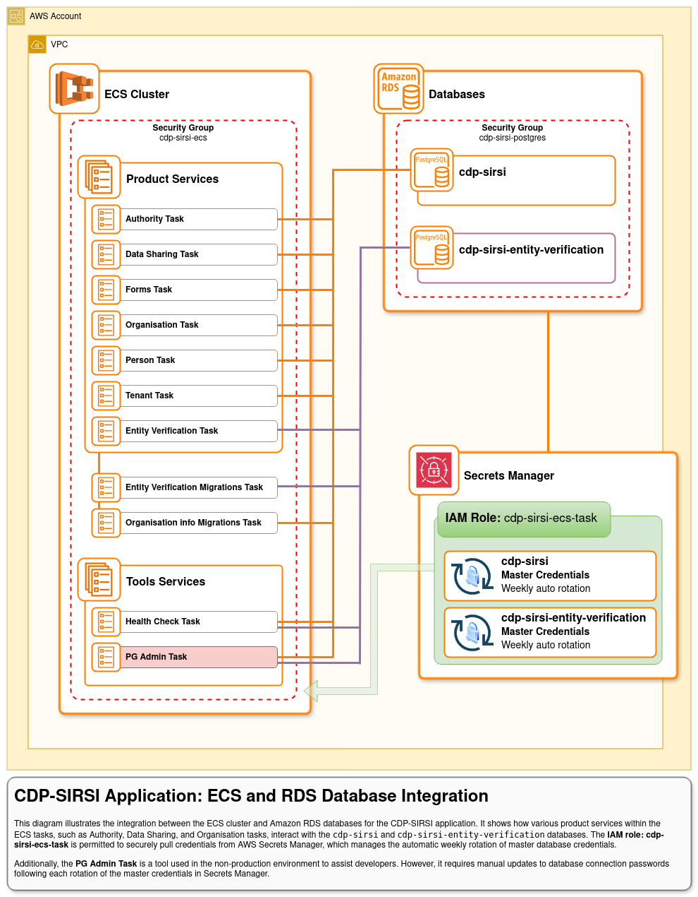
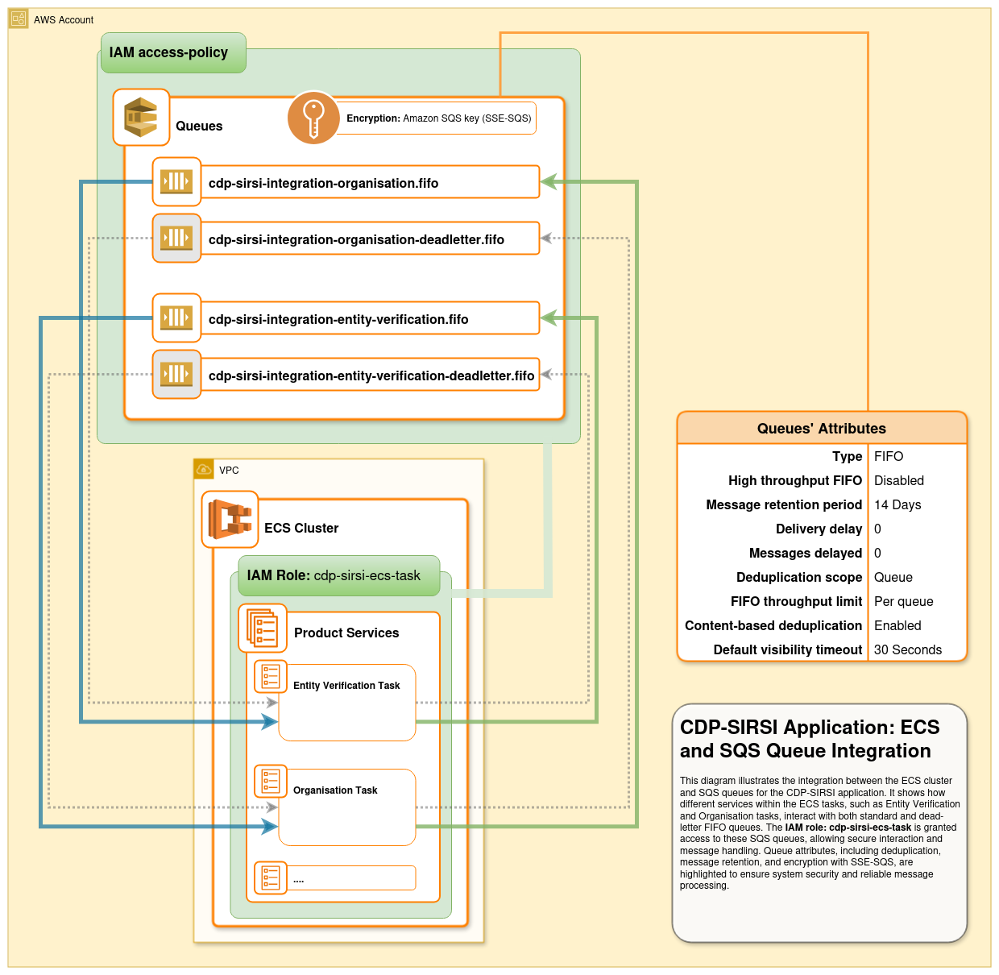

# CDP-SIRSI Infrastructure documentations

## Diagrams

- [CI/CD Build and Deployment Pipelines](#cicd-build-and-deployment-pipelines)
- [ECS and RDS Database Integration](#cdp-sirsi-application-ecs-and-rds-database-integration)
- [ECS and SQS Queue Integration](#cdp-sirsi-application-ecs-and-sqs-queue-integration)
- [High-Level Overview (DNS, Networking, ECS, and Data Flow)](#cdp-sirsi-application-high-level-overview-of-dns-networking-ecs-and-data-flow)

---

### CI/CD Build and Deployment Pipelines

This diagram provides a high-level overview of the CDP-SIRSI CI/CD build and deployment mechanisms. It illustrates the process starting from team members contributing to the codebase through GitHub workflows, including testing, building, and publishing Docker containers, to deploying changes across various AWS accounts.

Key highlights include:

- **Development Environment:** Always reflects the latest changes for both infrastructure and application.
- **Staging, Integration, and Production Environments:** Pinned to specific application versions to ensure controlled releases while the infrastructure always pulls updates from the latest main branch.
- **Orchestrator Account:** Tasks include provisioning and maintaining the CodePipeline and CodeBuild jobs for rolling out updates across all service accounts.
- **CloudWatch Event Rules:** Enable automated responses to key events, such as triggering new deployments when application service versions are updated.
- **Slack Feedback:** Provides notifications on the status of different deployment pipeline stages and actions.

This pipeline ensures a reliable and controlled process for deploying changes across environments, maintaining infrastructure consistency while allowing for precise application versioning.

---

### CDP-SIRSI Application: ECS and RDS Database Integration

This diagram illustrates the integration between the ECS cluster and Amazon RDS databases for the CDP-SIRSI application. It shows how various product services within the ECS tasks, such as Authority, Data Sharing, and Organisation tasks, interact with the cdp-sirsi and cdp-sirsi-entity-verification databases. The IAM role: cdp-sirsi-ecs-task is permitted to securely pull credentials from AWS Secrets Manager, which manages the automatic weekly rotation of master database credentials.

Additionally, the PG Admin Task is a tool used in the non-production environment to assist developers. However, it requires manual updates to database connection passwords following each rotation of the master credentials in Secrets Manager.

---

### CDP-SIRSI Application: ECS and SQS Queue Integration

This diagram illustrates the integration between the ECS cluster and SQS queues for the CDP-SIRSI application. It shows how different services within the ECS tasks, such as Entity Verification and Organisation tasks, interact with both standard and dead-letter FIFO queues. The IAM role: cdp-sirsi-ecs-task is granted access to these SQS queues, allowing secure interaction and message handling. Queue attributes, including deduplication, message retention, and encryption with SSE-SQS, are highlighted to ensure system security and reliable message processing.

---

### CDP-SIRSI Application: High-Level Overview of DNS, Networking, ECS, and Data Flow

This diagram provides an overview of the CDP-SIRSI application’s architecture, covering DNS records, load balancing, ECS services, and database connections. It includes key services and interactions but does not represent the complete implementation details.

---
